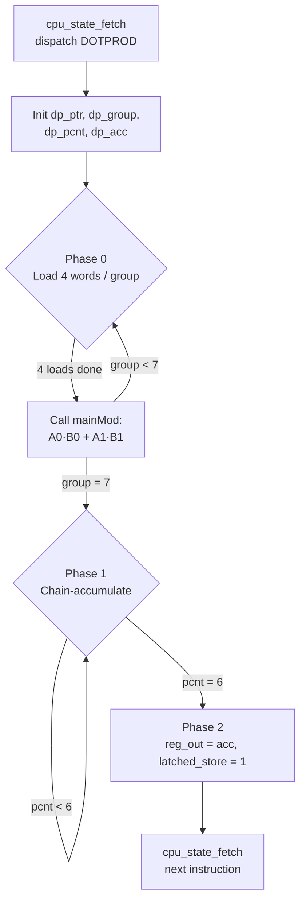

# IEEE‑754 Single‑Precision 16‑Pair Dot Product on a Modified PicoRV32 (RV32I)

A custom floating-point extension to [PicoRV32](https://github.com/YosysHQ/picorv32) that adds native single-precision FMA-style instructions and a single-dispatch **DOTPROD** instruction computing a 16-pair fused dot product entirely in hardware.

Project Elective, IIIT Bangalore — guided by **Prof. Subir Kumar Roy**
Authors: **Rajdeep Alapati**, **Kusumanchi Vinay**

---

## Overview

Floating-point dot products (`Σ A[i]·B[i]`) sit at the core of matrix multiplication, neural-network inference, and DSP kernels. On a stock RV32I core with no FPU, a 16-pair dot product takes on the order of 100 load/multiply/add instructions. This project closes that gap by embedding a custom IEEE‑754 single-precision fused unit directly into PicoRV32's execute pipeline and exposing it through four new instructions — culminating in `DOTPROD`, which computes a full 16-pair inner product in a **single instruction dispatch**.

The floating-point datapath (`mainMod`) computes `A×B ± C×D` combinationally, with proper IEEE‑754 rounding and NaN/Inf/Zero handling, using a Dadda-tree multiplier and a Kogge–Stone exponent adder. Three instances of it are wired into the PicoRV32 ALU.

## What's New

- **Three new FP instructions:** `FMUL.S`, `FMADD.S`, `FMSUB.S`
- **One micro-coded instruction:** `DOTPROD` — `rd ← Σ_{i=0}^{15} A[i]·B[i]` from a 16-pair interleaved array in memory
- **`mainMod`** — a fully combinational IEEE‑754 SP unit computing `A×B + C×D` (or `A×B − C×D`), with a Dadda carry-save-array multiplier, sticky rounding (round-to-nearest-even), and special-case handling
- **Three `mainMod` instances** embedded in the ALU: one for `FMUL.S`, one shared by `FMADD.S`/`FMSUB.S`, and a dedicated instance driving the `DOTPROD` state machine
- A new **R4-type-capable PCPI interface** (`pcpi_rs3`) so a third source register can be decoded and routed to FP instructions, all within the standard 32-bit RISC-V encoding space
- The CPU state register grows from 8 states to **9** (one-hot), adding `cpu_state_dotprod`
- Nine pre-existing bugs in the reference floating-point HDL were found and fixed before integration (see [Bug Fixes](#bug-fixes-in-mainmod))

## Repository Structure

```
.
├── picorv32.v      # Modified PicoRV32 core (base instructions + FP extensions)
├── mainMod.v        # IEEE-754 SP fused unit + all sub-modules (dadda, csa4_2, FA/HA,
│                     #   KSA_8, normalize, leadOne, stickyRound, etc.)
└── docs/
    ├── PicoRV_Final_Report.pdf      # Full project report (architecture, bug list, synthesis)
    └── Progress_Report.pdf          # Week-by-week progress log
```

> The reference architecture is adapted from Sohn & Swartzlander, *"Improved Architectures for a Floating-Point Fused Dot Product Unit,"* IEEE ARITH 2013 — cited in the report, not redistributed here for copyright reasons. Link it from `docs/` instead of committing the publisher PDF if you plan to keep this repo public.

## The `mainMod` Floating-Point Unit

`mainMod` is a fully combinational IEEE‑754 single-precision unit:

```
out = A × B + C × D     when op = 1
out = A × B − C × D     when op = 0
```

`rnd_mode[1:0]` selects the IEEE‑754 rounding mode (`2'b11` = round-to-nearest-even, used throughout this project).

| Port | Direction | Width | Description |
|---|---|---|---|
| `A`, `B`, `C`, `D` | input | 32 | IEEE‑754 SP operands |
| `op` | input | 1 | 1 = add, 0 = subtract |
| `rnd_mode` | input | 2 | IEEE‑754 rounding mode |
| `out` | output | 32 | IEEE‑754 SP result |

**Pipeline of combinational sub-blocks:**

1. **Sign logic** — result sign from operand signs and `op`
2. **Exponent compare** — finds the larger exponent to align significands
3. **Path select** — effective-addition vs. effective-subtraction path
4. **Dadda multiplier** (`dadda` → `csa4_2` → `FA`/`HA`) — 48-bit partial products via a carry-save array with 3-input XOR trees
5. **Significand compare** — selects the larger-magnitude operand for subtraction
6. **2's complement** — negates the smaller significand when required
7. **Normalize / leadOne** — left-shifts the result, adjusts the exponent
8. **Exponent adjust** (`expAdjust`, `KSA_8`) — adds the normalization shift using an 8-bit Kogge–Stone adder
9. **Sticky rounding** — round-to-nearest-even
10. **Special-case mux** — NaN, ±∞, ±0
11. **Output assembly** — packs `{sign[0], exp[7:0], mant[22:0]}`

### Bug Fixes in `mainMod`

Nine bugs in the original reference HDL were identified and corrected before integration:

| # | Module | Issue | Fix |
|---|---|---|---|
| 1 | `complement_2s` | `pos`/`condition` regs not reset between calls — stale state corrupted later results | Reset both at the top of the `always` block |
| 2 | `leadOne` | Integer `flag` never reset — MSB found correctly only on the first call | `flag = 0` at top of `always` block |
| 3 | `pathSelect` | `op_sel` declared `[7:0]` but used as 1-bit everywhere else — width mismatch | Changed to a plain 1-bit input |
| 4 | `stickyRound` | 8-bit `mux_2_1` used to select a 1-bit rounding signal — port-width elaboration error | Replaced with a direct 1-bit assign mux |
| 5 | `mainMod` | Final output never assembled as `{sign, exponent, mantissa}` — wire copied verbatim | Proper IEEE‑754 field packing |
| 6 | `mainMod` | `normalize` called with a 4th port `[31:0] out1` the module doesn't expose | Mantissa extracted from `[45:23]` of the result |
| 7 | `mainMod` | `expAdjust` output exponent never wired into the final result | `final_exp` now drives the output |
| 8 | `KSA.v` | 32-bit module was an FPGA VIO debug stub (real ports commented out, a Xilinx `vio_0` core wired in instead) — unusable for synthesis/sim | Excluded; `KSA_8` (8-bit) used everywhere, since all exponent arithmetic is 8-bit |
| 9 | `mainMod` | NaN/Inf/Zero handling absent | IEEE‑754-compliant special-case mux added at the output |

## Changes to `picorv32.v`

| Area | Change |
|---|---|
| **New parameter** | `USE_PCPI_MUL` (default 0) — gates the legacy PCPI multiply cores so the native FP multiply path doesn't double-instantiate multiply hardware |
| **`TWO_CYCLE_ALU`** | Default changed `0 → 1`, since `mainMod` is combinational but deep; registering ALU output avoids timing violations on Artix‑7 |
| **New PCPI port** | `pcpi_rs3` — exposes a third source register (`reg_op3`) to any external PCPI co-processor implementing R4-type instructions |
| **New operand register** | `reg_op3` — holds `rs3` for FMA/FMS and the FMA inputs during dot-product accumulation |
| **New decode field** | `decoded_rs3` (5 bits) — captures `insn[31:27]`, the R4-type third-source-register field; read out via `cpuregs_rs3` |
| **New instruction flags** | `instr_mul`, `instr_fma`, `instr_fms`, `instr_dotprod` — wired into the decoder, ALU, illegal-instruction trap, and reset logic |
| **New decode flag** | `is_fp_op` — identifies any OP-FP instruction (opcode `1010011`) |
| **ALU** | Three `mainMod` instances instantiated at module scope: `fmul_unit`, `fma_unit`, `dp_mmod`; `alu_out` mux extended with `instr_mul`/`instr_fma`/`instr_fms` cases |
| **CPU state machine** | Widened `8'b → 9'b`; new one-hot state `cpu_state_dotprod` occupies bit 8 (MSB), no collision with the original 8 states |
| **Debug** | `dbg_rs3val` / `dbg_rs3val_valid` formal-keep signals, matching the existing `rs1`/`rs2` pattern |
| **Reset** | `instr_fma`, `instr_fms`, `instr_dotprod` explicitly cleared on reset |
| **Formal verification** | State-validity assertion extended: `if (cpu_state == cpu_state_dotprod) ok = 1;` |

## New Instructions

| Instruction | Opcode | Format | Operation |
|---|---|---|---|
| `FMUL.S` | `7'b1010011` (OP-FP) | `funct5 = 00010`, `fmt = 00` | `rd ← float(rs1 × rs2)` |
| `FMADD.S` | `7'b1000011` | R4-type, `fmt = 00` | `rd ← float(rs1 × rs2 + rs3)` |
| `FMSUB.S` | `7'b1000111` | R4-type, `fmt = 00` | `rd ← float(rs1 × rs2 − rs3)` |
| `DOTPROD` | `7'b1001011` | Custom, I-type-like | `rd ← Σᵢ₌₀¹⁵ A[i]·B[i]`, `rs1` = base address |

- **`FMUL.S`** reuses the `fmul_unit` instance of `mainMod` with `C = +0.0`, `D = +1.0`, so `out = A×B + 0 = A×B`. Result available after one registered ALU cycle.
- **`FMADD.S` / `FMSUB.S`** are RISC-V R4-type ops. `insn[31:27]` encodes `rs3`. The shared `fma_unit` computes `rs1×rs2 ± rs3` with a single IEEE‑754 rounding step (no double-rounding); the sign is selected by `fma_op = instr_fma ? 1 : 0`.
- **`DOTPROD`** is opcode-matched only (`insn[6:0] == 7'b1001011`); the source layout follows `{12'b0, rs1, 3'b000, rd, 7'b1001011}`. It is the project's primary contribution — detailed below.

## `DOTPROD` Deep Dive

### Memory Layout

A single base address in `rs1` points to 32 contiguous 32-bit words (128 bytes), interleaved as:

| Offset (bytes) | Word | Contents |
|---|---|---|
| 0 | 0 | A[0] |
| 4 | 1 | B[0] |
| 8 | 2 | A[1] |
| 12 | 3 | B[1] |
| … | … | … |
| 120 | 30 | A[15] |
| 124 | 31 | B[15] |

### State Machine

`cpu_state_dotprod` dispatches immediately after `rs1` is read (it doesn't need `rs2`/`rs3`) and runs a 2-bit sub-phase (`dp_phase`):



- **Phase 0 — Load pairs:** 4 words loaded per group (`A[2i]`, `B[2i]`, `A[2i+1]`, `B[2i+1]`); 8 groups → 8 calls to the dedicated `dp_mmod` instance, each computing `A[2i]×B[2i] + A[2i+1]×B[2i+1]` (`op=1`).
- **Phase 1 — Chain accumulate:** the 8 partial sums in `dp_partial[0:7]` are summed via 7 sequential `dp_mmod` calls: `acc ← acc + dp_partial[6−k]` for `k = 0..6` (implemented as `A×1.0 + C×1.0`).
- **Phase 2 — Writeback:** `reg_out ← dp_acc`, `latched_store = 1`; FSM returns to `cpu_state_fetch` for normal register writeback.

### Key Registers

| Register | Width | Purpose |
|---|---|---|
| `dp_ptr` | 32 | Current memory read address |
| `dp_load_phase` | 2 | Which of the 4 words in a group is loading |
| `dp_group` | 3 | Which of 8 groups (0–7) is active |
| `dp_a0`, `dp_b0`, `dp_a1`, `dp_b1` | 32 each | Buffers for `A[2i]`, `B[2i]`, `A[2i+1]`, `B[2i+1]` |
| `dp_partial[0:7]` | 32×8 | Eight partial sums |
| `dp_pcnt` | 3 | Accumulation step counter (0–6) |
| `dp_acc` | 32 | Running accumulator (IEEE‑754 SP) |
| `dp_phase` | 2 | Top-level phase (0 = load, 1 = accumulate, 2 = done) |
| `dp_compute_req` / `dp_compute_wait` | 1 each | Request / registered-wait pulse for the `mainMod` call |
| `dp_mmod_A/B/C/D`, `dp_mmod_op` | 32 / 1 | Inputs to the dedicated `dp_mmod` instance |

### Timing

Since `TWO_CYCLE_ALU = 1`, every `mainMod` result costs one registered wait cycle (`T_compute = 2`: one request + one wait):

```
T = 8 × (4 × T_load + T_compute)   [Phase 0]
  + 7 × T_compute                  [Phase 1]
  + 1                              [Phase 2]
```

where `T_load` is the memory-system latency for a single word read.

## Building & Synthesizing

The design targets a **Xilinx Artix‑7 (xc7a35tcpg236-1)** via Vivado.

1. Add `picorv32.v` and `mainMod.v` as design sources in a Vivado project (or your simulator of choice).
2. Set `USE_PCPI_MUL = 0` unless you also need the legacy iterative/fast PCPI multiplier alongside the native FP path.
3. `TWO_CYCLE_ALU` should stay at its new default of `1` — `mainMod`'s combinational depth needs the registered ALU stage to close timing.
4. Run synthesis/elaboration; simulate against a testbench that exercises `FMUL.S`, `FMADD.S`, `FMSUB.S`, and `DOTPROD` before targeting hardware.

> **Current synthesis status:** the carry-save-array sub-block (`csa4_2`) has been synthesized standalone in Vivado 2025.1 with **0 errors, 0 critical warnings**, consuming **96 LUTs** (no DSPs, no BRAMs) — confirming the multiplier core is purely combinational with no register inference. **Full top-level synthesis of `picorv32` with all three `mainMod` instances** (for complete LUT/FF counts and timing closure) is the next milestone — see [Roadmap](#roadmap--future-work).

| Resource | Used | Available | Util % |
|---|---|---|---|
| Slice LUTs | 96 | 20,800 | 0.46% |
| Slice Registers | 0 | 41,600 | 0.00% |
| Block RAMs | 0 | 50 | 0.00% |
| DSPs | 0 | 90 | 0.00% |

*(figures are for the isolated `csa4_2` carry-save sub-block — the full processor will use proportionally more LUTs once synthesized end-to-end.)*

## Roadmap / Future Work

- [ ] Full-chip synthesis of the complete modified `picorv32` (all three `mainMod` instances) for real timing-closure and LUT/FF numbers
- [ ] Pipeline the combinational `mainMod` path (2–3 stages) to raise max frequency
- [ ] Parameterize `DOTPROD` length beyond 16 pairs (via the decoded immediate field)
- [ ] Double precision: extend `mainMod` to 64-bit (`fmt = 01`) for `FMADD.D`/`FMSUB.D`
- [ ] Assembler macros and a C intrinsic for `DOTPROD` to benchmark against software FP libraries
- [ ] Formal verification with SymbiYosys over the extended ISA

## References

1. C. X. Wolf, "PicoRV32 — A Size-Optimized RISC-V CPU," YosysHQ, [github.com/YosysHQ/picorv32](https://github.com/YosysHQ/picorv32), 2015–2024.
2. A. Waterman, K. Asanović (eds.), "The RISC-V Instruction Set Manual, Volume I: Unprivileged ISA," RISC-V International, v20191213, 2019.
3. IEEE Standard for Floating-Point Arithmetic, IEEE Std 754-2019.
4. M. Ercegovac and T. Lang, *Digital Arithmetic*, Morgan Kaufmann, 2004.
5. L. Dadda, "Some Schemes for Parallel Multipliers," *Alta Frequenza*, vol. 34, pp. 349–356, 1965.
6. J. Sohn and E. E. Swartzlander, Jr., "Improved Architectures for a Floating-Point Fused Dot Product Unit," *2013 IEEE 21st Symposium on Computer Arithmetic*, DOI: 10.1109/ARITH.2013.26.

## License

This project builds on PicoRV32, which is free and open hardware licensed under the **ISC license** (© Claire Xenia Wolf / YosysHQ). Retain PicoRV32's original license notice in `picorv32.v` and choose a compatible license for `mainMod.v` and the rest of this repository — ISC or MIT are natural choices for consistency.

## Acknowledgements

This work was carried out as a Project Elective under the guidance of **Prof. Subir Kumar Roy**, IIIT Bangalore. The dot-product architecture is adapted and debugged from the design described in Sohn & Swartzlander (IEEE ARITH 2013).
